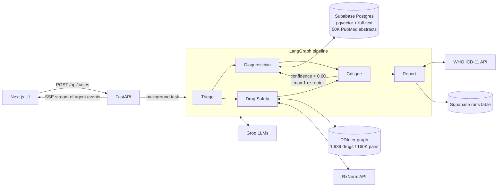

# MedOrchestra — Project Overview

A guide to how MedOrchestra works, what it uses, what we built and what the evaluation showed. Written to prepare the team for the review.

> Research prototype on synthetic/open data. Not for clinical use.

---

## 1. What the project is

MedOrchestra is a **multi-agent clinical decision support system (CDSS)**. Given a patient case (chief complaint, vitals, current medications, age, sex), it produces:

- an **urgency level** (LOW / MEDIUM / HIGH),
- a **differential diagnosis** (top 3) with **ICD-11 codes** and **PubMed citations**,
- **drug–drug interaction warnings** for the current medications,
- a **senior-reviewer critique**: confidence, concerns, missed diagnoses, clarification questions and treatment cautions.

It implements the architecture proposed by **Borkowski et al. (2025), "Multiagent AI Systems in Health Care"** (PMC12360800). Requirements are in `MedOrchestra_PRD(1).pdf`.

**Our novel contribution is the Critique agent and its feedback loop.** A second LLM from a *different model family* reviews the diagnosis adversarially, checks the citations in code, and can send the case back to the Diagnostician once with specific feedback.

**Scope decisions:**
- Exactly **4 agents**: Triage, Diagnostician, Drug Safety, Critique. "Report" is an assembly step, not an agent.
- **Synthetic and open data only.** No EHR/FHIR integration and no clinical deployment.

---

## 2. Architecture at a glance



**Flow:** `START → triage → {diagnostician ∥ drug_safety} → critique → (diagnostician | report) → END`

1. **Triage** runs first, because urgency and red flags feed into the later agents.
2. **Diagnostician and Drug Safety run in parallel**, in the same LangGraph superstep, which saves latency.
3. **Critique** runs once both have finished.
4. If the Critique's confidence is below **0.60**, it **re-routes** to the Diagnostician, **at most once** (as the PRD requires). Only the Diagnostician re-runs; Drug Safety's result is reused.
5. **Report** assembles everything, adds ICD-11 codes and saves the run.

---

## 3. Tech stack

| Layer | Choice | Why |
|---|---|---|
| Orchestration | **LangGraph** | Graph with parallel branches, conditional edges (the re-route) and a custom event stream |
| Backend API | **FastAPI** + Server-Sent Events | Async, typed (Pydantic), simple streaming |
| Frontend | **Next.js 16** (App Router, React 19) + **Tailwind v4** | Live agent timeline, report view, history, print-to-PDF |
| LLMs (via **Groq**) | `openai/gpt-oss-120b` (agents), `qwen/qwen3.8-27b` (Critique and eval judge), `openai/gpt-oss-20b` (fallback) | Free tier, fast inference, strict JSON-schema output |
| Vector DB | **Supabase Postgres + pgvector** (`halfvec(768)`) | Free hosted Postgres; vectors and full-text search in one database |
| Embeddings | **MedCPT** query encoder, article encoder and cross-encoder (NCBI) | Trained on PubMed search logs, so it fits biomedical retrieval |
| Literature | **PubMed** via NCBI E-utilities | 50,000 abstracts on 130 topics |
| Drug interactions | **DDInter 2.0** → **NetworkX** undirected graph | Open, graded severities (minor / moderate / major) |
| Drug names | **RxNorm** (NLM RxNav) | Maps brand names, typos and combination products to ingredients |
| Coding | **WHO ICD-11 API** | Official codes for each diagnosis |
| Early-warning score | **NEWS2** | UK national standard, deterministic and auditable |
| Testing | pytest (81 tests, fully offline), ruff | Fake LLM and fake retriever fixtures |

### Deviations from the PRD (and why)

| PRD said | We used | Reason |
|---|---|---|
| Flask | FastAPI | Native async and SSE, Pydantic validation |
| Local Postgres | Supabase pgvector | Hosted and free; the team can share it |
| DrugBank CSV | DDInter + RxNorm | DrugBank's free CSV has **no interaction data** |
| SEWS | NEWS2 | NEWS2 is the current, widely validated standard |
| Sequential agents | Drug Safety ∥ Diagnostician | Lower latency |
| One embedding model | MedCPT hybrid retrieval + reranker | Better precision on medical text |
| Llama 3 70B | gpt-oss-120b | `llama3-70b-8192` was retired on Groq; model names stay in config |
| 500K abstracts | 50K abstracts | The Supabase free tier is 500 MB; 50K fit in ~362 MB |

---

## 4. The four agents in detail

Every agent is an `async def agent(state, ctx) -> dict` wrapped in `@agent_node("name")` (`backend/app/agents/base.py`). The wrapper emits `agent_started`, `agent_completed` (with duration and output) and `agent_failed` events, which stream live to the UI.

**Design rule: every agent still works without an LLM.** If the Groq key is missing, or a call fails or runs out of time, the agent falls back to deterministic rules. The system degrades gracefully instead of crashing.

### 4.1 Triage agent (`agents/triage.py`, `news2.py`, `red_flags.py`)

1. **NEWS2 score** is computed from respiratory rate, SpO₂, systolic BP, heart rate, temperature, consciousness (ACVPU) and supplemental O₂.
   - A total of 7 or more gives **HIGH**.
   - A total of 5–6, or any single parameter scoring 3, gives **MEDIUM**.
   - Anything else is **LOW**.
2. **LLM triage** (an "ED triage nurse" prompt, 6 s budget) gives its own urgency and red flags.
3. **Safety rule:** final urgency = **max(NEWS2, LLM)**. The LLM may *escalate* but never *downgrade*.
4. **Without an LLM**, regex **red-flag rules** escalate to HIGH. They cover chest pain, radiation to the arm or jaw, diaphoresis, thunderclap headache, neck stiffness, breathing difficulty, airway swelling, GI bleeding, altered consciousness, suicidal ideation, and pregnancy with pain or bleeding. As a result, classic ACS with normal vitals is never triaged LOW.

### 4.2 Diagnostician agent (`agents/diagnostician.py`, `services/retrieval.py`)

A **hypothesis-driven RAG** pipeline:

1. **Hypotheses:** the LLM proposes up to 5 candidate diagnoses, each with a PubMed search query.
2. **Hybrid retrieval:** the case query and every hypothesis query are searched in Supabase:
   - **dense** search: the MedCPT query encoder plus pgvector inner product (`<#>`),
   - **keyword** search: Postgres full-text, bounded to 300 matches (an AND search first, then OR),
   - the two are fused with **Reciprocal Rank Fusion (RRF)** in the `hybrid_search` SQL function.
3. **Reranking:** candidates are pooled round-robin (up to 12), and the **MedCPT cross-encoder** scores each one against the query that found it. The top 8 abstracts are kept.
4. **Differential:** the LLM picks the top 3 diagnoses and must cite evidence ids such as `[E3]`. **Ids that weren't retrieved are dropped in code**, so it can't hallucinate a citation.
5. **On a re-route**, the Critique's flags, missed diagnoses and questions are added to the prompt. The first pass's evidence is reused, and only the new queries are searched.

### 4.3 Drug Safety agent (`agents/drug_safety.py`, `services/drug_graph.py`, `drug_names.py`)

1. **Name resolution** goes exact → synonym groups → **RxNorm** (approximate match, score ≥ 7, then ingredients) → fuzzy match. This handles brands ("Lipitor"), typos and combination products ("Percocet" → oxycodone + paracetamol).
2. **Interaction lookup** checks every pair in the **DDInter graph**: 1,939 drugs and 160K pairs, undirected because interactions are symmetric. Duplicate pairs keep the most severe level.
3. **Severity always comes from DDInter, never from the LLM.** The LLM only writes the `explanation` and `clinical_action` text, and only for graded pairs (not "unknown" ones).

### 4.4 Critique agent (`agents/critique.py`) — the novel part

Two checks run concurrently:

1. **LLM "senior attending" review** on **Qwen**, a *different model family* from the gpt-oss Diagnostician, so it doesn't share the same blind spots. The prompt is told to be adversarial (challenge anchoring, unsupported claims and missed dangerous conditions). It returns:
   - a calibrated **confidence** (0–1),
   - a one-sentence concern for each diagnosis,
   - **missed diagnoses**,
   - up to 3 **clarification questions**,
   - **likely first-line treatments**.
2. **Code-side citation check:** the MedCPT cross-encoder scores each pair of (diagnosis, cited abstract). A score of 8 or more counts as "supported"; on-topic abstracts score about 12–16 and irrelevant ones about 2–7.

The two checks feed into these decision rules:
- An **unsupported leading diagnosis caps confidence at 0.55**, which forces a re-route.
- If **confidence < 0.60** and no re-route has happened yet, the Critique **re-routes** to the Diagnostician with its feedback.
- **Treatment cautions:** the likely treatments are checked against the patient's current medications in DDInter. Example: a suggested antibiotic interacts with the patient's warfarin.
- **Without an LLM**, a deterministic rules review is used instead.

### 4.5 Report node (`agents/report.py`, `services/icd.py`)

- Looks up **ICD-11 codes** once, on the final differential. It uses WHO's `search` endpoint plus a qualifier rule, so "Dengue fever" must not become "Severe dengue". WHO's `autocode` endpoint returns HTTP 500 on release 2026-01, so `autocode` on 2025-01 is the fallback.
- Builds the `ClinicalReport` (case, urgency, triage, diagnoses, interactions, critique, re-route count, disclaimer).

---

## 5. LLM service (`services/llm.py`)

- **Structured output:** Groq strict `json_schema` mode. Pydantic models are converted to strict schemas (refs inlined, all fields required, constraint keywords removed). Pydantic still validates the response, with one repair round-trip.
- **Time budgets:** each call has a wall-clock budget. The primary model gets 60% of it, then the **fallback model** gets the rest. Agent budgets (triage 6 s, Critique 7 s, drug explanations 8 s) are sized for the PRD's ≤15 s target.
- **Retries:** for 429 (rate limit), 503 (unavailable) and Qwen's random `json_validate_failed` 400 errors.
- **SQLite response cache**, keyed by the request body, makes evaluation runs **reproducible**.
- Groq quirks we found: Qwen with strict mode and `reasoning_format: "hidden"` produces garbage, so we use `"parsed"`. httpx timeouts are per read, so the total time is enforced with `asyncio.timeout`.

---

## 6. Streaming, persistence and the UI

### Backend API (`app/api.py`, `app/runs.py`)

| Endpoint | Purpose |
|---|---|
| `GET /api/health` | Health check |
| `POST /api/cases` | Validates the case, starts the graph as a background task, returns `run_id` (202) |
| `GET /api/runs` | Recent runs ("Recent cases" panel) |
| `GET /api/runs/{id}` | A run's report and events (live, or loaded from the database after a restart) |
| `GET /api/runs/{id}/stream` | **SSE** stream of agent events |

- Each SSE event has `id:` set to the event index and `data:` set to JSON with a `type` field. Reconnects resume from `Last-Event-ID`, so a browser reconnect never **re-runs the case**.
- The stream always ends with a `done` event.
- Finished runs are saved to the Supabase **`runs` table** (case, report and full event list, ~112 kB each), so past runs can be replayed. Saving is best-effort: a database failure never breaks the live result.

### Frontend (`frontend/src/`)

| File | Role |
|---|---|
| `components/CaseForm.tsx` | Case input: complaint, vitals, medications, age, sex |
| `components/AgentTimeline.tsx` | Live per-agent progress, including "attempt 2" after a re-route |
| `components/ReportPanel.tsx` | Final report: urgency, differential with citations and ICD-11, interactions, critique |
| `components/RunHistory.tsx` | Recent cases with timeline replay |
| `hooks/useRunStream.ts` | Folds SSE events into per-agent, per-attempt UI state |
| `lib/types.ts` | TypeScript mirror of the backend event and report schemas |
| Export PDF | Browser print-to-PDF with print CSS (light mode) |

---

## 7. Data sources and licences

| Source | Use | Licence |
|---|---|---|
| **PubMed** (NLM E-utilities) | 50K abstracts on 130 topics, including every DDXPlus condition | Abstracts © publishers; used for research retrieval |
| **DDInter 2.0** | Drug–drug interaction graph | CC BY-NC-SA 4.0 (non-commercial; not committed to the repo) |
| **RxNorm** (NLM RxNav API) | Drug name normalization | Public API |
| **WHO ICD-11 API** | Diagnosis codes | WHO API terms |
| **DDXPlus** (Fansi Tchango et al., 2022) | Synthetic patients for evaluation | CC BY 4.0 |

Corpus engineering notes:
- Embedding ran on the CPU (i5-1235U) at about 5–8 articles/s with length-sorted batches; unsorted padding gave only 2.4/s.
- Int8 quantization was rejected: only 0.94 cosine similarity to fp32.
- An unbounded keyword search took about 7 s on a cold cache and silently broke the retrieval budget, so it is capped at 300 matches.

---

## 8. Evaluation (Phase 6)

### Method

- **Dataset:** **DDXPlus**, one case per pathology class (49 classes + 1 = 50 planned). **44 cases were run.** The other 6 were blocked by Groq's free-tier limit (200K tokens per day per model; one case costs about 15–20K tokens).
- **Three arms per case:**
  1. **MedOrchestra (final, with Critique)**
  2. **Ablation, no Critique:** the Diagnostician's first-pass answer from the *same run*, so no extra calls are needed
  3. **Baseline:** a single LLM call on the same model
- **LLM judge:** Qwen, a different family from the gpt-oss models it grades. It is given all 49 DDXPlus class names so it can tell near-synonyms from different classes. We spot-checked it by hand and corrected one lenient error (`ddx-002`: supraglottitis is epiglottitis, a separate class, so it shouldn't count for laryngitis).
- **DDI recall:** 150 graded DDInter pairs, tested with generic names and with US brand names via RxNorm.

### Results (44 cases)

| Metric | Result | PRD target | Met? |
|---|---|---|---|
| Top-1 accuracy (with Critique) | **57%** | ≥65% | ❌ |
| Top-3 accuracy (with Critique) | **70%** | ≥80% | ❌ |
| Ablation, no Critique (top-1 / top-3) | 57% / 66% | — | |
| Single-LLM baseline (top-1 / top-3) | 55% / 75% | — | |
| Re-routed cases (26/44), top-3 before → after the Critique | 50% → 58% | — | |
| Retrieval (RAG) precision, LLM-judged | **72%** | ≥70% | ✅ |
| DDI recall, generic names | **100%** (150/150) | ≥80% | ✅ |
| DDI recall, US brand names | **95%** (75/79) | ≥80% | ✅ |
| Latency, median | **15.1 s** (49% ≤15 s; single-pass 9.9 s) | ≤15 s | ≈ borderline |
| Critique calibration (Pearson r) | **0.47** (approximate measure) | ≥0.6 | ❌ |

### What the results mean

- **The Critique improves the Diagnostician:** top-3 rises from 66% to 70% overall, and from 50% to 58% on re-routed cases. Example: in `ddx-040`, only the final arm found **scombroid food poisoning**.
- **Sometimes it overrides a correct answer.** In `ddx-037` (pulmonary neoplasm) and `ddx-038` (SLE), the first pass had the right diagnosis at #1. The Critique gave it 0.1 confidence, and the re-routed pass dropped it. That's why the single-LLM baseline edges us on top-3. The likely cause is that the re-route prompt says a reviewer **"rejected"** the differential, which pushes the model to rewrite everything. **Planned fix:** "revise" wording that keeps strong candidates.
- **Some re-routes change nothing.** In `ddx-029` (myocarditis) and `ddx-034` (pneumonia), the second pass repeated the first.
- **The models prefer dangerous diagnoses:** stable angina became "acute coronary syndrome", and myocarditis became pericarditis/ACS. That's clinically defensible (rule out the killers first) but costs accuracy on DDXPlus. Some labels are symptom-level ("Localized edema"), which no model is likely to name.
- **Latency is dominated by Groq free-tier rate-limit retries and by re-routes**, which need a second search and rerank. Local compute is not the bottleneck. Single-pass cases take about 10 s.
- **Retrieval and drug safety are strong.** Both exceed their targets. The 4 brand-name misses are biologics and unusual products that RxNorm can't map to DDInter names.

### Limitations (say these before the panel does)

- The judge is an **LLM, not physicians**. It was spot-checked and given the class list, but it can still err.
- **Calibration is a proxy**: confidence vs top-1 correctness, while the PRD asks for physician ratings.
- **44 cases is a small sample**: one case per class, so each class is tested only once.
- **DDInter has gaps** (e.g. no ACE inhibitor + spironolactone pair). We don't invent missing pairs.
- **No rule-based diagnosis baseline.** Without an LLM, the Diagnostician deliberately returns no differential instead of guessing.
- The harness flags a case as "degraded" only when a whole agent falls back to rules, not when a single call is served by the fallback model.

---

## 9. Safety design (worth highlighting)

1. **Urgency can only go up:** max(NEWS2, LLM). The LLM can never downgrade a NEWS2 score.
2. **Red-flag rules** keep dangerous presentations at HIGH even without an LLM.
3. **Drug severities come only from DDInter.** The LLM explains a pair but never grades it.
4. **Citations are validated in code**, and unretrieved ids are dropped. The Critique also checks with the cross-encoder that each cited abstract supports its diagnosis.
5. **The Critique uses a different model family**, so its review is more independent.
6. **Every agent has a rules fallback**, so the system works with no API key.
7. **The re-route is capped at 1**, so there's no infinite loop and latency stays bounded.
8. **A disclaimer** is attached to every report.

---

## 10. Repository map

```
backend/
  app/
    agents/        triage, diagnostician, drug_safety, critique, report, news2, red_flags, base
    graph/         builder.py (LangGraph wiring), state.py (ClinicalState + reducers)
    services/      llm, retrieval, embeddings (MedCPT), drug_graph, drug_names (RxNorm), icd, run_store
    api.py         REST + SSE endpoints
    runs.py        run manager (event buffer, replay, persistence)
    schemas.py     Pydantic models (CaseInput, ClinicalReport, …)
    config.py      all settings and thresholds
  pipelines/       download_ddinter, ingest_pubmed (+130 topics), migrate
  migrations/      001 pubmed_chunks + hybrid_search, 002 bounded keyword search, 003 runs table
  eval/            ddxplus.py (case builder), run_eval.py, ddi_recall.py, results/
  tests/           81 offline tests (fake LLM / retriever fixtures)
frontend/
  src/app, components/, hooks/useRunStream.ts, lib/{api,types}.ts
docs/PROJECT_OVERVIEW.md   this document
```

### Key numbers to remember

| | |
|---|---|
| Agents | 4 (+ report node) |
| PubMed corpus | 50,000 abstracts, 130 topics, ~362 MB |
| Drug graph | 1,939 drugs, ~160K interaction pairs |
| Re-route threshold / cap | confidence < 0.60 / max 1 |
| Retrieval | 6 hits per query → pool of 12 → top 8 to the LLM |
| Citation support threshold | cross-encoder score ≥ 8 |
| Tests | 81, all offline |
| Eval | 44 DDXPlus cases, 3 arms, Qwen judge |

---

## 11. Running it

```powershell
# Backend (http://127.0.0.1:8000)
cd backend
.\.venv\Scripts\python -m uvicorn app.main:app --reload --port 8000

# Frontend (http://localhost:3000)
cd frontend
npm run dev
```

On a Windows machine where **Smart App Control** blocks PyTorch's DLLs, run the backend in **WSL** instead:

```bash
cd /mnt/c/MedOrchestra/backend && ~/mo-venv/bin/python -m uvicorn app.main:app --port 8000
```

Full setup (data download, migrations, ingestion) is in `README.md`.

---

## 12. Likely review questions and short answers

**Q: Why multi-agent instead of one big prompt?**
Each agent has a narrow job, its own tools (NEWS2, PubMed, DDInter, ICD-11) and its own safety rules. The single-LLM baseline shows what one prompt alone does (55% top-1). Multi-agent gives citations, drug checks, auditability and graceful fallbacks, which one prompt can't guarantee.

**Q: What's new compared with the paper?**
The paper proposes the architecture. We implemented it with an **adversarial Critique from a different model family**, **code-verified citations**, and a **bounded feedback loop** that sends specific critique back to the Diagnostician. We then measured that loop with an ablation.

**Q: Why didn't you hit the accuracy target?**
We're close on top-3 (70% vs 80%). The failure analysis points to two causes: the Critique sometimes overrides correct answers (a prompt-wording issue with a planned fix), and the models favour dangerous diagnoses over benign labels. Some DDXPlus labels are symptom-level. The free tier also limited us to 44 cases.

**Q: How do you stop hallucinated citations?**
The LLM may only cite ids from the abstracts we actually retrieved, and any other id is dropped in code. The Critique then checks with a cross-encoder that each cited abstract supports its diagnosis. An unsupported leading diagnosis forces a re-route.

**Q: Can the LLM make a patient look less urgent than they are?**
No. Final urgency = max(NEWS2, LLM), and the red-flag rules escalate even without an LLM.

**Q: Why is the Critique a different model?**
A model reviewing its own output tends to agree with itself. Qwen and gpt-oss come from different families, so their errors are less correlated. For the same reason, the evaluation judge is also not a gpt-oss model.

**Q: What happens if Groq is down?**
Every agent has a rules fallback, and there's a fallback model within each call's time budget. The report still arrives, marked `method: "rules"`.

**Q: Why DDInter and not DrugBank?**
DrugBank's free download has no interaction data. DDInter is open and graded, and RxNorm handles brand names.

**Q: Is the evaluation reproducible?**
Yes. All LLM responses are cached in SQLite, the DDXPlus case selection uses a fixed seed, and every per-case prediction is saved in `backend/eval/results/cases.jsonl`.

**Q: What's next?**
1. Fix the re-route wording and re-measure.
2. Finish the 50 cases, and ideally evaluate on more cases per class.
3. Collect physician ratings for real calibration.
4. Tune the retrieval and citation-support thresholds against labelled data.
5. Move to a paid LLM tier, which removes the rate-limit retries and their latency.
